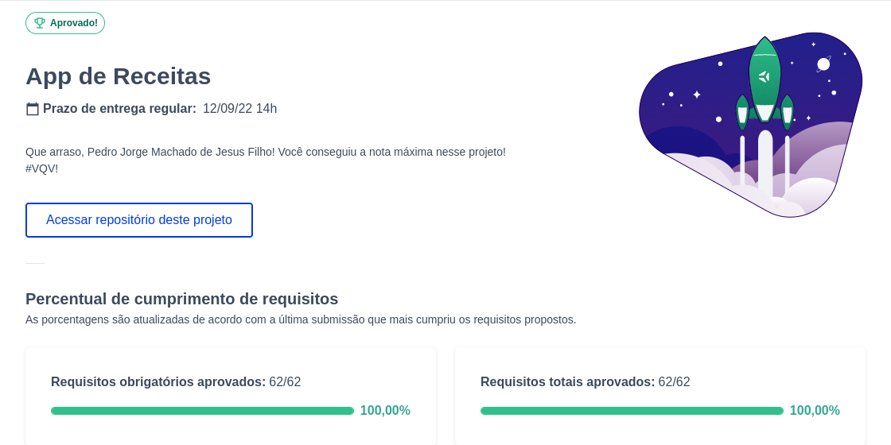

# Boas-vindas ao meu Projeto App de Receitas!

  Este projeto foi desenvolvido em grupo 👥, agradecimentos aos colegas [Vinicius_Barbosa](https://github.com/ViniciusBF), [João_Emanuel](https://github.com/joaoespacheco), [João_Sousa](https://github.com/rsajoao) que participaram da organização e confecção de componentes / páginas.

# Sobre o Projeto

<strong> 🍹 Preview 🥘</strong>
 

  
<strong>🖥🪛 Principais Tecnologias utilizadas</strong>
 
  
  - React 
  - JavaScript 
  - Jest 
  - Css 
  - Html 
  - Api 🍱 [TheMealDB](https://www.themealdb.com/api.php)
  - Api 🍾 [TheCocktailDB](https://www.thecocktaildb.com/api.php)

  
<strong>👨‍💻 O que foi desenvolvido</strong>
 

  Este projeto tem como objetivo criar uma aplicação mobile utilizando as API's TheMealDB e CockTailDB para proporcionar ao usuário uma experiência divertida, aprendendo receitas de comidas e bebidas de várias nacionalidades. Nele é possível favoritar, compartilhar e salvar as receitas já realizadas e em andamento.

  
<strong>Habilidades Desenvolvidas</strong>
 

  Nesse projeto, foi utilizado:

  - Context API do _React_ para gerenciar estado
  - _React Hook useState_
  - _React Hook useContext_
  - _React Hook useEffect_
  - Hooks customizados
  - _Jest_ para testes

# Orientações

  
<strong>Visualizando o código </strong>
 

  1. Clone o repositório

  - Use o comando: `git clone git@github.com:PedroJoMa/AppDeReceitas.git`.
  - Acesse a pasta do repositório que você acabou de clonar:
    - `cd Projeto-App-de-Receitas.`
  2. Instale as dependências

  - Instale as dependências:
    - `npm install`
    - `npm install react-icons` (caso ocorra erros na renderização da página).
  - Inicialize o projeto:
    - `npm start` (uma nova página deve abrir no seu navegador)
    - A confecção deste projeto utilizou a resolução de tela de `360 x 640` (360 pixels de largura por 640 pixels de altura).
      - ⏰ Recomendo usar esta mesma resolução, faça a instalação [deste](https://chrome.google.com/webstore/detail/window-resizer/kkelicaakdanhinjdeammmilcgefonfh?hl=en) plugin do Chrome para facilitar a configuração.

<strong>🏆 Notas 🏆 </strong>
 

